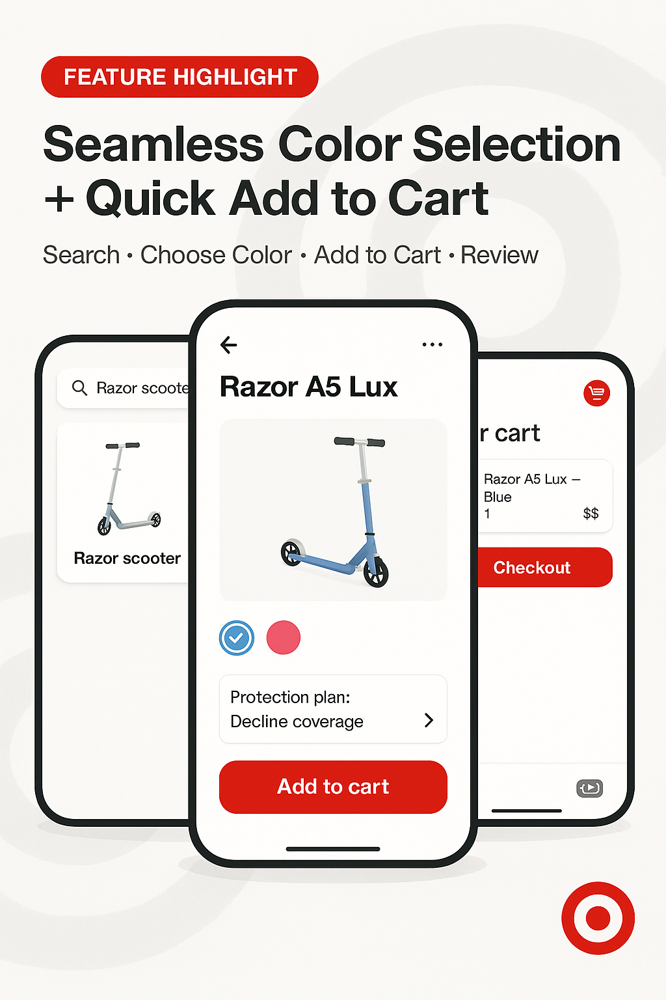

# Arcade AI Interview Challenge

Welcome to the Arcade AI Interview Challenge! This project tests your ability to work with AI multimodal APIs, and be creative with your problem solving

## 🎯 Challenge Overview

You've been provided with a `flow.json` file that contains data from an Arcade flow recording. Your task is to build a script that analyzes this flow data and creates a comprehensive report.

## 📋 Requirements

Your application should accomplish the following:

1. **Identify User Interactions**: List out the actions the user did in a human readable format (i.e. "Clicked on checkout", "Search for X")
2. **Generate Human-Friendly Summary**: Create a clear, readable summary of what the user was trying to accomplish
3. **Create a Social Media Image**: Generate an creative image suitable for sharing on social platforms that represents the flow and would drive engagement

These items should be then displayed in a **markdown file** that can be committed in your project

## 🛠️ Technical Requirements

- **Language**: Any
- **AI Integration**: You will be provided an OpenAI API key, but feel free to use providers you have accounts with
- **Version Control**: Use GitHub/Bitbucket to track your work - we want to see your development process and commit history

## 🔒 Security Note

**IMPORTANT**: Never commit your API key to version control! Use environment variables or a `.env` file (and add it to `.gitignore`) to keep your API key secure.

## 📁 Project Structure

You'll be provided with:
- `flow.json` - The flow data to analyze
- OpenAI API key 


Your application should generate:
- A comprehensive markdown report
- A social media image file

## 🎨 Arcade Flow Reference

The flow data comes from this Arcade recording: https://app.arcade.software/share/2RnSqfsV4EsODmUiPKoW

You can view the original flow to understand what the user was doing, your solution should be general purpose enough to work for most Arcade flows.

## 💡 Hints

- The `flow.json` contains different types of steps (IMAGE, CHAPTER, VIDEO, etc.)
- Each step has metadata about what the user clicked and when
- Think about how to structure your analysis for maximum clarity
- The social media image should be professional and represent the flow's purpose
- Feel free to use different models types to both understand the flow and generate the image

## Sample Output

### Summary
```
## User Interactions
1. Tapped the search bar to begin looking for a product.  
2. Clicked the Razor A5 Lux scooter image to view product details and options.  
3. Selected the Blue color option.  
4. Viewed an additional color option (Pink).  
5. Clicked "Add to cart" to add the scooter to the shopping cart.  
6. Selected "Decline coverage" (chose not to add a protection plan).  
7. Opened the cart (clicked the cart icon/badge to review items).

## Summary
The user searched Target.com for a Razor scooter, opened the scooter's product page, reviewed color options (Blue and Pink), added the scooter to their cart, declined the optional protection plan, and then navigated to their cart to review the selected item before proceeding to checkout.
```

### Social Media Image

